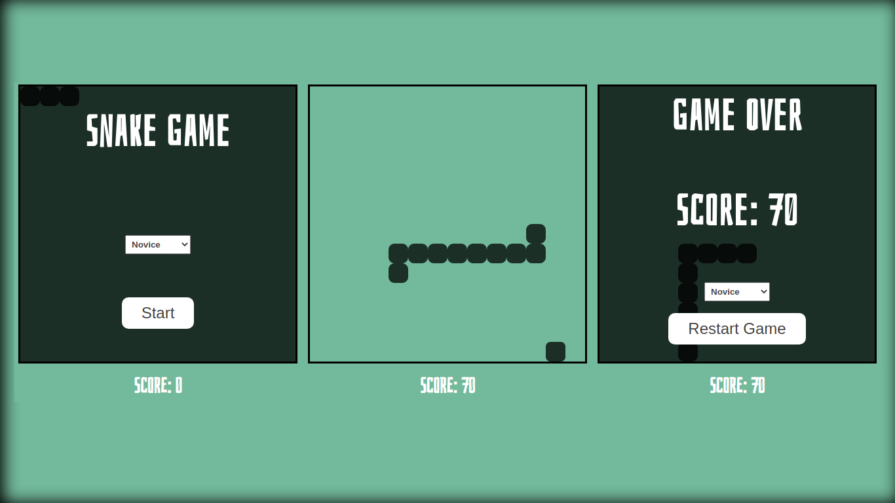

# A Snake Game Created By Pure JavaScript

The old Snake Game was created By Vanilla JavaScript.
Functionality:
- Snake grows as it catches apples.
- User score increase as snake catches apples.
- Snake speed up to a certain point as it catches apples.
- Apples move to another place after randomly but logically created time.
- User can select games level (novice, rookie, master) (speed and max-speed increase as level up, apple relocation time decreases as level up)

## Built With

- HTML, CSS, JavaScript

## Live

[Snake Game ](https://emirsagit.github.io/snake-game/)

## Getting Started

To get a local copy up and running first you need to clone the repo. After that, open index.html with your browser.

## Authors

👤 **Emir Sağıt**

- GitHub: [@emirsagit](https://github.com/emirsagit)
- Twitter: [@emirsagit](https://twitter.com/emirsagit)
- LinkedIn: [Emir Sağıt](https://www.linkedin.com/in/emir-sa%C4%9F%C4%B1t-633035188/)

## Thanks

Inspired from [Scrimba](https://scrimba.com/) lesson. I personally recommend it to everyone who wants to be a front-end developer.

## 🤝 Contributing

Contributions, issues, and feature requests are welcome!

Feel free to check the [issues page](../../issues/).

## Show your support

Give a ⭐️ if you like this project!

## 📝 License

This project is [MIT](./MIT.md) licensed.
